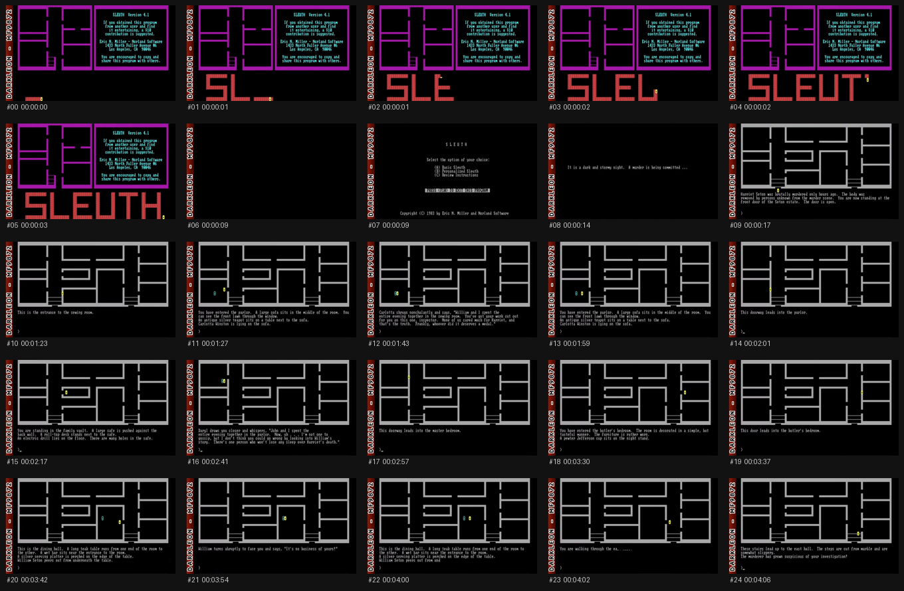

# Example: SLEUTH 4.1 gameplay

A worked example of framesleuth on real gameplay footage — fittingly, of the
original **SLEUTH Version 4.1** (Norland Software), the DOS game this repository
reimagines.

- **Source:** [`sleuth-gameplay.mp4`](./sleuth-gameplay.mp4) — 640×360, ~4m38s,
  30 fps.
- **Command:**
  ```bash
  python -m framesleuth examples/sleuth-gameplay/sleuth-gameplay.mp4 \
      -o out --fps 2 --method phash
  ```
- **Result:** 557 sampled frames (2 fps) deduplicated down to **25 distinct
  shots**. Each kept frame has a `.txt` OCR sidecar in [`frames/`](./frames);
  full per-frame records (timestamp, phash, text) are in
  [`manifest.json`](./manifest.json).



The OCR captured the game's on-screen text well — the intro ("It is a dark and
stormy night. A murder is…"), the victim ("Harriet Seton was brutally
murdered…"), and room-by-room descriptions (sewing room, parlor, family vault,
master bedroom, butler's bedroom, dining hall, east hall) — exactly the "valid
player/object position + textual example" per shot this tool is meant to
produce.

The `contact_sheet.png` here is a convenience overview generated for the README;
framesleuth itself outputs the individual PNGs and the manifest.
